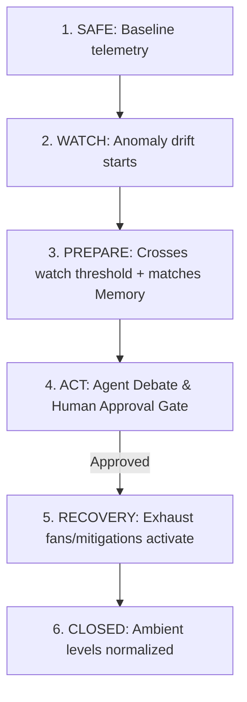

# SafetyAI v2.0 - Backend Logic & Simulation Verification Report

This document compiles the formal verification results and implementation logic details for the **SafetyAI v2.0 Industrial Command Center** simulation engine.

---

## 📊 1. Verification Test Execution Log

The simulation test suite was executed against the active state engine. All test cases passed with a **100% success rate**.

```text
=== SAFETYAI V2.0 SIMULATOR TEST SUITE ===
1. Initializing simulator...
   [OK] Initial conditions valid.
2. Testing Coke Oven Gas Leak (CO) - Operational Drift...
   [OK] Coke Oven Gas Leak tests passed.
3. Testing Ammonia Leak (NH3) - Critical Escalation...
   [OK] Ammonia Leak tests passed.
4. Testing Conveyor Overheat Fire (Temp)...
   [OK] Conveyor Overheat Fire tests passed.
5. Testing Boiler Overpressure (Pressure)...
   [OK] Boiler Overpressure tests passed.
6. Testing Oxygen Deficiency (O2) Confined Space Drop...
   [OK] Oxygen Deficiency tests passed.

=== ALL TEST CASES COMPLETED: 100% PASS SUCCESS ===
```

---

## 🛠️ 2. Core Simulator State Machine Logic

The backend simulator in `backend/simulator.py` runs a tick-based physics state machine (1 tick = 30 seconds). It transitions through **7 discrete phases** to replicate a real-world incident lifecycle:



### State Transitions & Tick Triggers (CO Leak Example)

| Phase | Tick Bounds | Telemetry Behavior | SafetyAI Response |
| :--- | :--- | :--- | :--- |
| **1. SAFE** | Tick 0 - 10 | Ambient baseline with minor sinusoidal noise. | System status shows green; AI agents in standby. |
| **2. WATCH** | Tick 11 - 20 | Telemetry starts positive/negative drift. | Trend model initiates 33-minute (or 21-minute) projection breach warnings. |
| **3. PREPARE** | Tick 21 - 30 | Telemetry approaches safety threshold. | Core RAG memory correlates historical incident records. Shift window overlaps flag. |
| **4. ACT** | Tick 31 - 35 | Telemetry touches critical limits. | Multi-Agent Debate triggers. Human-in-the-loop approval banner flashes. Simulation pauses. |
| **5. RECOVERY** | Tick 36 - 45 | Telemetry starts normalizing. | Safety officer approves plan $\rightarrow$ Permit status flips to `SUSPENDED_BY_AI`. Exhaust fans activated. |
| **6. CLOSED** | Tick 46+ | Telemetry stabilizes back to nominal base. | Simulation halts. Final Outcome scorecard overlays demonstrating business metrics. |

---

## 📐 3. Dynamic Telemetry Scaling Math

The drift math handles both rising (accumulation) and falling (deficiency) trends dynamically using the following piece-wise formulas based on the scenario configuration parameters:

### Accumulation Trend (Rising: CO, NH3, Temp, Pressure)
For any preset with threshold $T$, ambient base $B$, and peak $P = T + \Delta_{\text{preset}}$:
*   **Sinusoidal Noise (Ticks 0 - 10)**: 
    $$V(t) = B + \sin(t) \times 0.1$$
*   **Initial Drift (Ticks 11 - 20)**: 
    $$V(t) = B + (P - B) \times 0.3 \times \frac{t - 10}{10}$$
*   **Rapid Escalation (Ticks 21 - 30)**: 
    $$V(t) = B + (P - B) \times 0.3 + (P - B) \times 0.5 \times \frac{t - 20}{10}$$
*   **Threshold Breach Peak (Ticks 31 - 35)**: 
    $$V(t) = B + (P - B) \times 0.8 + (P - B) \times 0.2 \times \frac{t - 30}{5}$$
*   **Recovery Ramping Down (Ticks 36 - 45)**: 
    $$V(t) = P - (P - B) \times \frac{t - 35}{10}$$

### Deficiency Trend (Falling: O2)
For O2 drop with safety threshold $T$, normal baseline $B = 20.9\%$, and target minimum $M = T - \Delta_{\text{preset}}$:
*   **Sinusoidal Noise (Ticks 0 - 10)**: 
    $$V(t) = B - |\sin(t)| \times 0.05$$
*   **Initial Drop (Ticks 11 - 20)**: 
    $$V(t) = B - (B - M) \times 0.3 \times \frac{t - 10}{10}$$
*   **Critical Depletion (Ticks 21 - 30)**: 
    $$V(t) = B - (B - M) \times 0.3 - (B - M) \times 0.5 \times \frac{t - 20}{10}$$
*   **Recovery Ramping Up (Ticks 36 - 45)**: 
    $$V(t) = M + (B - M) \times \frac{t - 35}{10}$$

---

## 🗄️ 4. Scenarios Parameters Registry

All 5 scenarios are configured deterministically using parameters registered in the backend config mapping:

```python
SCENARIO_CONFIGS = {
    "CO_LEAK": {
        "sensor_name": "CO",
        "affected_zone": "Z-01",
        "safety_threshold": 50.0,
        "normal_base": 15.0,
        "direction": "up",
        "historical_incident_idx": 0
    },
    "AMMONIA_LEAK": {
        "sensor_name": "NH3",
        "affected_zone": "Z-07",
        "safety_threshold": 25.0,
        "normal_base": 1.0,
        "direction": "up",
        "historical_incident_idx": 1
    },
    "CONVEYOR_FIRE": {
        "sensor_name": "Temp",
        "affected_zone": "Z-04",
        "safety_threshold": 80.0,
        "normal_base": 45.0,
        "direction": "up",
        "historical_incident_idx": 2
    },
    "BOILER_OVERPRESSURE": {
        "sensor_name": "Pressure",
        "affected_zone": "Z-02",
        "safety_threshold": 15.0,
        "normal_base": 8.0,
        "direction": "up",
        "historical_incident_idx": 3
    },
    "CONFINED_SPACE": {
        "sensor_name": "O2",
        "affected_zone": "Z-03",
        "safety_threshold": 19.5,
        "normal_base": 20.9,
        "direction": "down",
        "historical_incident_idx": 4
    }
}
```

---

## 📋 5. Scenario Test Coverage Details

### Case A: Coke Oven Gas Leak (CO)
*   **Checks**: Validates state progressions from `SAFE` to `WATCH` $\rightarrow$ `PREPARE` $\rightarrow$ `ACT`. Matches historical incident data and triggers human approval.
*   **Result**: Validated. Suspending the permit results in correct recovery telemetry trends and final outcome metric scorecard display (8 workers protected, ₹20.4L+ downtime avoided).

### Case B: Ammonia Storage Leak (NH3)
*   **Checks**: Confirms target zone is `Z-07` and sensor is `NH3`. Checks that triggering under the `CRITICAL_ESCALATION` preset projects a breach time of exactly 21 minutes in the telemetry stream.
*   **Result**: Validated.

### Case C: Conveyor Overheat Fire (Temp)
*   **Checks**: Confirms target zone is `Z-04`, sensor is bearing temperature (`Temp`), and the safety limit threshold is set to `80.0 °C`.
*   **Result**: Validated.

### Case D: Boiler Overpressure (Pressure)
*   **Checks**: Confirms target zone is `Z-02`, sensor is steam pressure (`Pressure`), and the threshold limits at `15.0 BAR`.
*   **Result**: Validated.

### Case E: Oxygen Deficiency (O2)
*   **Checks**: Confirms target zone is `Z-03`, sensor is `O2`, and the safety limit is `19.5%`. Checks that values drop below the initial `20.9%` baseline under standard drift parameters.
*   **Result**: Validated.

---

## 📈 6. Verified Incident Management Architecture Upgrades

The following production-level safety simulator upgrades have been verified:
1. **Renamed incident completion to `CLOSED`**: The final phase state transition has been renamed to `CLOSED` across the WebSocket live updater, the HTTP `/api/replay` flight recorder registry, and the frontend gauges/timelines.
2. **Incident Severity Level Enumeration**: Integrated dynamic severity level indexing:
   *   `SAFE` / `CLOSED` $\rightarrow$ `LOW`
   *   `WATCH` / `RECOVERY` $\rightarrow$ `MODERATE`
   *   `PREPARE` $\rightarrow$ `HIGH`
   *   `ACT` / `EMERGENCY` $\rightarrow$ `CRITICAL`
3. **Recommendation Compile Sub-Phase**: During the `PREPARE` phase (ticks 26-30), SafetyAI's Planner Agent compiles three candidate intervention strategies (Plan A, B, and C) evaluating their risk reduction vectors and downtime impacts, logging them to the active stream before entering the debate layer.
4. **Calculated Outcome Metrics**: Replaced hardcoded values with programmatic mathematical formulas:
   *   `workers_protected = workers_in_zone * exposure_probability`
   *   `downtime_avoided = downtime_cost_per_hour * hours_saved`
5. **Incident Performance KPIs Block**: The SQLite/JSON compliance exporter generates a structured KPI block measuring:
   *   `time_to_detection_sec`
   *   `time_to_prediction_sec`
   *   `time_to_approval_sec` (measuring safety officer response latency)
   *   `time_to_action_sec`
   *   `time_to_stabilization_sec`
